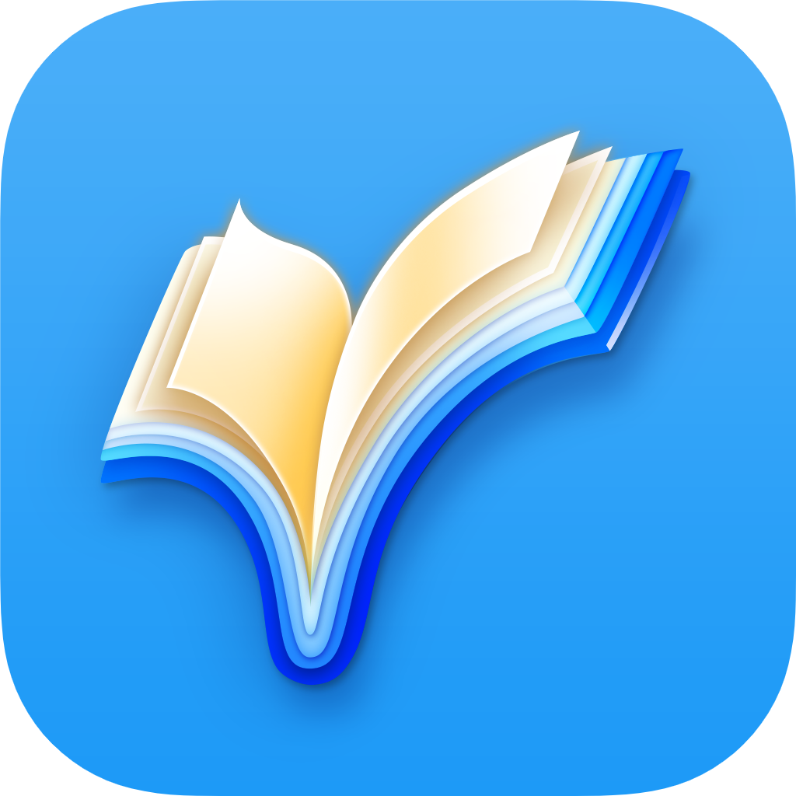

# Press Kit

Download the full [Press Kit](../assets/ReadingList_PressKit.zip), containing high resolution app images and screenshots (35MB).

## About Reading List

Reading List is a lightweight yet powerful reading tracker and planner, available for iOS and iPadOS.

Reading List is designed to make it incredibly easy to plan what to read, to track your reading progress, and to record information about the books you have read. Books can be easily added via barcode scan or online search, and all metadata is configurable. Users can add their own notes and ratings, and use the powerful organisation functions to create their own lists of books.

Reading List is designed to be a clear and accessible personal book log; it follows the iOS human interface guidelines to bring a design which is intuitive and beautiful. The app is fully functional when offline; when online data synchronises seamlessly between multiple devices via iCloud. With iOS 14, users can place their books on their homescreen for even faster access.

Reading List has been a free app since 2017, and has a growing and passionate userbase. On 7th April 2021, version 2.0 was released, bringing the biggest updates yet.

### App Details

**Apple App ID:** [1217139955](https://apps.apple.com/us/app/reading-list-book-log/id1217139955)  
**Website**: [https://readinglist.app](https://readinglist.app)  
**Twitter**: [@ReadingListApp](https://twitter.com/ReadingListApp)  

### Developer Details
**Name**: Andrew Bennet  
**Twitter**: [@AndrewBennet](https://twitter.com/AndrewBennet)  
**Email**: [feedback@readinglist.app](mailto:feedback@readinglist.app)  

## Features

- Lookup books by scanning their barcode
- Find books by searching online
- Full manual metadata control
- Record start and finish dates each time you read a book
- Plan what to read next by ordering your To Read books
- Create custom lists of books
- Record current page number and see progress visually
- Add rating and notes to your books
- Export / import your data to / from CSV for full control
- Nightly iCloud backup to keep your data safe
- Realtime iCloud sync across different devices
- Conveneient swipe actions and shortcuts, for fast management of your books
- Supports widgets, to show your books on your homescreen and lockscreen

## Loved by Users

Reading List has been exceptionally well received by its users. It is the highest-rated reading tracking app in the App Store, with a 4.8 rating from over 30,000 ratings and reviews.

## Pricing

Reading List is free to download. Some advanced features are available after unlocking Reading List Pro, which is available at launch for a one-off payment.

## Media

For full set of images, download the [Press Kit](../assets/ReadingList_PressKit.zip).

